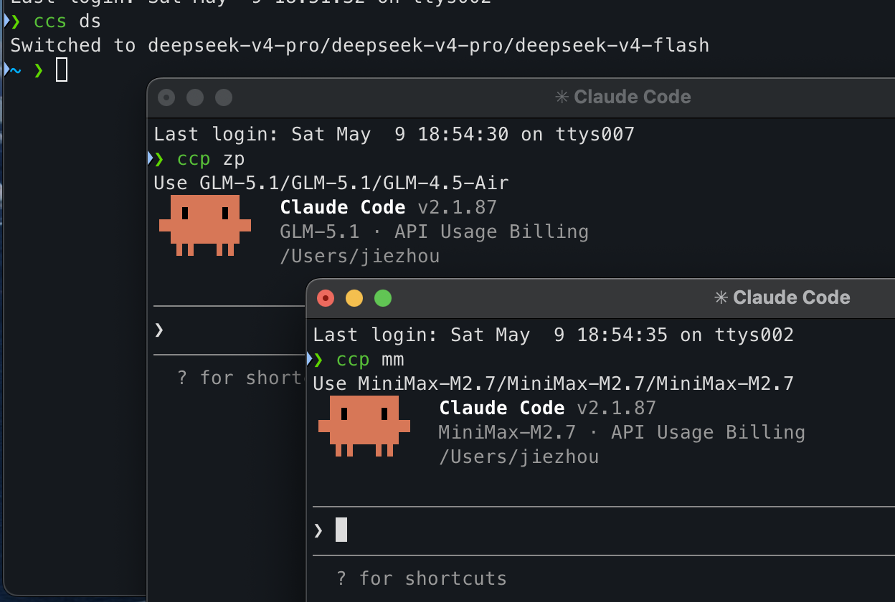

# cc-bin

> [中文说明](README-CN.md)

<p align="center">
  
</p>

Two ~40-line Zsh scripts to switch or isolate LLM providers for [Claude Code](https://claude.ai/code). Zero dependencies. No magic — just associative arrays and heredocs.

[Anthropic](https://api.anthropic.com), [Zhipu](https://open.bigmodel.cn), [MiniMax](https://minimax.chat), [DeepSeek](https://deepseek.com), [Mimo](https://mimoml.com) all expose Anthropic-compatible APIs. These scripts help you manage them.

## Why two scripts?

The official `cc-switch` is heavy. `ccs` does the same thing in ~40 lines.

Switching your global provider mid-session disrupts active conversations and ties all sessions to one provider's concurrency limits. `ccp` solves this — each invocation gets its own settings via `--settings`, leaving your global config untouched.

## Usage

```bash
# Switch global provider
ccs <an|zp|mm|ds|mimo>

# One-shot launch (reads credentials from env vars, no global change)
ccp [an|zp|mm|ds|mimo] [claude options...]
```

## Providers

| Key | Provider | Sonnet | Opus | Haiku |
|-----|----------|--------|------|-------|
| an  | Anthropic | claude-sonnet-4-6 | claude-opus-4-6 | claude-haiku-4-5 |
| zp  | Zhipu    | GLM-5.1 | GLM-5.1 | GLM-4.5-Air |
| mm  | MiniMax  | MiniMax-M2.7 | MiniMax-M2.7 | MiniMax-M2.7 |
| ds  | DeepSeek | deepseek-v4-pro | deepseek-v4-pro | deepseek-v4-flash |
| mimo | Mimo    | mimo-v2.5-pro | mimo-v2.5-pro | mimo-v2.5-pro |

## Setup

```bash
# 1. Clone
git clone https://github.com/<your-username>/cc-bin.git ~/cc-bin

# 2. Add to PATH in ~/.zshrc
export PATH="$HOME/cc-bin:$PATH"

# 3. Set credentials in ~/.zshrc (only need the ones you use)
export ANTHROPIC_BASE_URL="https://api.anthropic.com"
export ANTHROPIC_API_KEY="your-key"
export DEEPSEEK_BASE_URL="https://api.deepseek.com"
export DEEPSEEK_API_KEY="your-key"
# ... etc

source ~/.zshrc
```

API endpoint = `BASE_URL` + `/anthropic`.

## License

MIT
